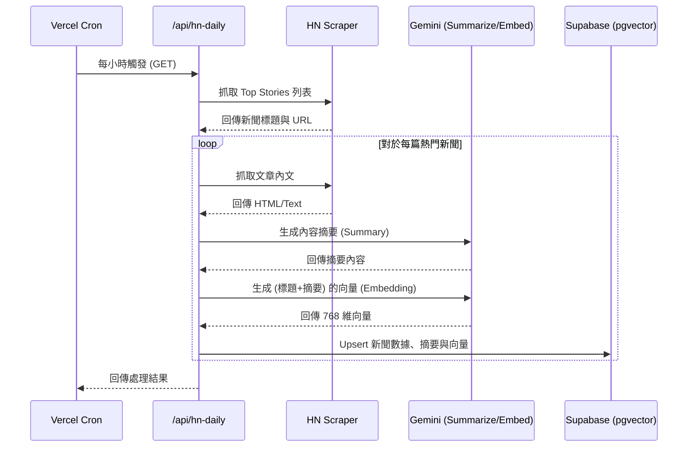
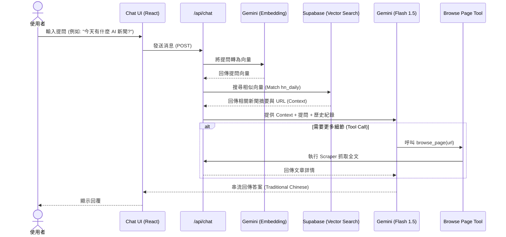

# Hacker News AI Assistant 專案技術文檔

本專案是一個整合了 Hacker News (HN) 內容抓取、AI 摘要生成以及 RAG (檢索增強生成) 技術的智慧助手。

## 1. 技術規格 (Tech Spec)

### 前端與框架
- **Next.js 16 (App Router)**: 使用最新版本進行開發。
- **Tailwind CSS 4**: 提供現代化的響應式 UI 設計。
- **Lucide React**: 圖標庫。

### AI 與 RAG
- **Vercel AI SDK**: 用於處理串流響應 (`streamText`) 與工具調用 (`tools`)。
- **Google Gemini 1.5 Flash**: 作為核心 LLM，平衡了速度與理解能力。
- **Embeddings**: 使用 Gemini 模型將文本轉換為向量。
- **Supabase (pgvector)**: 存儲新聞數據與向量值，實現語義搜索。

### 後端與爬蟲
- **Cheerio**: 用於抓取 HN 列表與文章網頁內容。
- **Supabase Client**: 負責與數據庫交互。
- **Vercel Cron**: 定期觸發同步任務。

---

## 2. 工作流程循序圖

### A. 定時同步流程 (Cron Job)
此流程負責維持數據庫中的新聞時效性。

### B. 使用者提問與 RAG 流程 (User Interaction)
此流程展示了如何結合 RAG 與 Context 來回答使用者問題。

---

## 3. 數據庫結構 (Spec)

### `hn_daily` 資料表
| 欄位名 | 類型 | 說明 |
| :--- | :--- | :--- |
| id | uuid | 主鍵 |
| date | date | 新聞日期 (YYYY-MM-DD) |
| rank | int | 當日排名 (1-50) |
| title | text | 新聞標題 |
| url | text | 原始網址 |
| summary | text | AI 生成的摘要 |
| embedding | vector(768) | 標題與摘要的向量值 |
| points | int | HN 分數 |
| created_at | timestamp | 建立時間 |

---

## 4. 關鍵功能特點
1. **語義搜索**: 不僅僅是關鍵字比對，透過向量搜尋能理解使用者意圖（如搜尋「人工智慧」也能找到「LLM」相關新聞）。
2. **Context 注入**: 在 System Prompt 中注入檢索到的新聞，確保 AI 回答有據可依。
3. **即時工具調用**: 如果 RAG 提供的摘要不足，AI 可以動態決定去「閱讀」特定網頁以獲取更多資訊。
4. **自動化維護**: 透過 Cron Job 確保數據庫每日自動更新。
